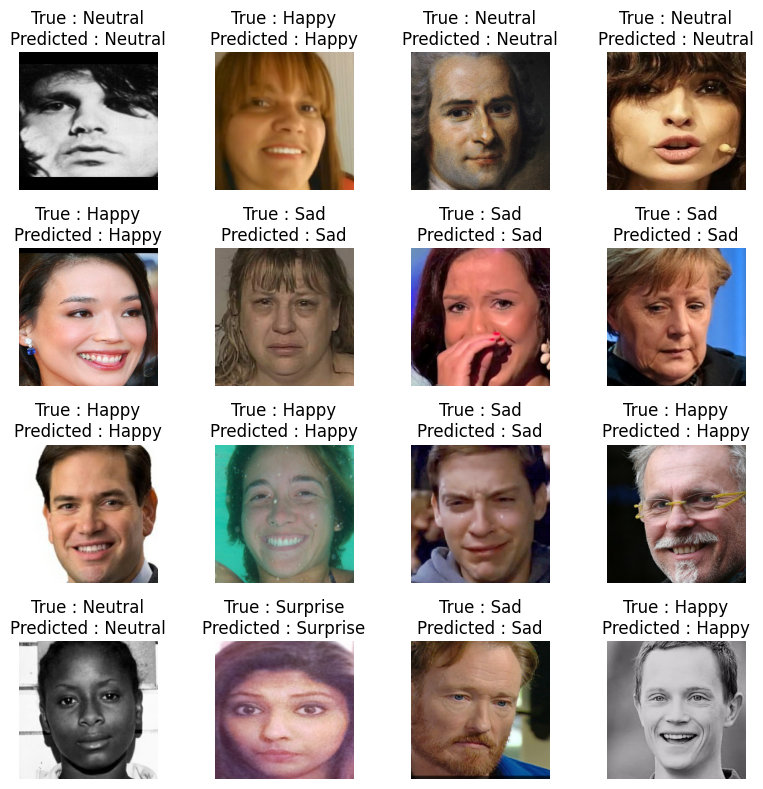
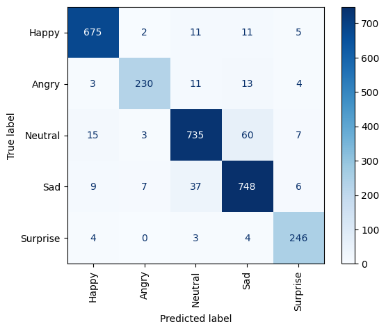

# Emotion Classification Using Convolutional Neural Networks (CNN)
This project implements a Convolutional Neural Network (CNN) **using the pre-trained EfficientNetV2B0 model** to classify emotions from facial images. The model was trained on the Kaggle dataset: [Emotion Recognition Dataset](https://www.kaggle.com/datasets/sujaykapadnis/emotion-recognition-dataset), which includes five emotion categories: Happy, Angry, Neutral, Sad, and Surprise.

## Project Overview
The goal of this project is to classify human emotions based on facial images using deep learning techniques. The CNN architecture, based on **EfficientNetV2B0**, was fine-tuned on the Emotion Recognition dataset to achieve high accuracy on emotion classification tasks. This project can be extended for applications such as emotion-aware systems, sentiment analysis, and real-time emotional recognition.

## Model Performance

#### Validation Accuracy: 92.21%
#### Training Loss: 10.3668
#### Validation Loss: 10.8729
### Sample Predictions:  

### Confusion Matrix:  



## Configuration
The model was trained with the following configuration:
```python
CONFIGURATION = {
    'VALIDATION': 0.2,  # 20% validation data
    'BATCH_SIZE': 64,   # 64 images per batch
    'IM_SIZE': 224,     # Image size: 224x224 pixels
    'LEARNING_RATE': 1e-3,  # Initial learning rate
    'N_EPOCHS': 50,     # Number of epochs
    'DROPOUT_RATE': 0.25,  # Dropout to avoid overfitting
    'REGULARIZATION_RATE': 0.01,  # L2 regularization rate
    'N_FILTERS': 6,     # Number of convolutional filters
    'KERNEL_SIZE': 5,   # Size of convolutional kernel
    'N_STRIDES': 1,     # Stride size for convolution
    'POOL_SIZE': 2,     # Max-pooling size
    'N_DENSE_1': 128,   # Units in the first dense layer
    'N_DENSE_2': 32,    # Units in the second dense layer
    'NUM_CLASSES': len(CLASS_NAMES),  # Number of emotion classes
    'CLASS_NAMES': CLASS_NAMES,  # Emotion class names
}
```
## Dataset
The dataset used for training the model can be found on Kaggle: [Emotion Recognition Dataset](https://www.kaggle.com/datasets/sujaykapadnis/emotion-recognition-dataset). It consists of facial images categorized into five emotion classes: Happy, Angry, Neutral, Sad, and Surprise.

To download the dataset, use the following command in your **terminal**:
```python
pip install kaggle
kaggle datasets download -d sujaykapadnis/emotion-recognition-dataset
unzip emotion-recognition-dataset.zip
```
**Or in Google Colab:**
```python
!pip install kaggle
!kaggle datasets download -d sujaykapadnis/emotion-recognition-dataset
!unzip emotion-recognition-dataset.zip
```
## Preprocessing and Augmentation
Images were resized to 224x224 pixels to match the input requirements of EfficientNetV2B0. Data augmentation techniques such as horizontal flipping, rotation, and scaling were applied to improve the model’s robustness and generalization.

## Model Architecture
The model is based on the pre-trained EfficientNetV2B0 architecture, which was fine-tuned for this classification task. EfficientNet is known for its balance between accuracy and efficiency, making it ideal for tasks involving image classification on a large dataset.

